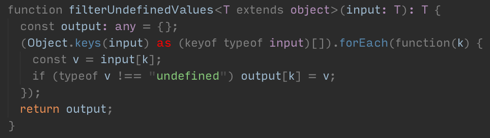
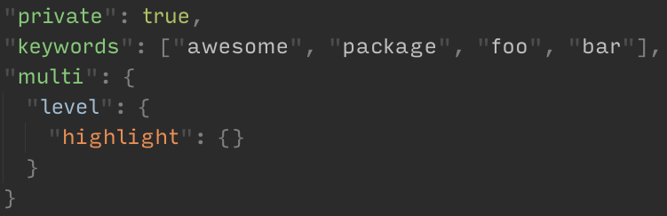

# Meaningful syntax highlighting for Atom



Color your syntax not arbitrarily, but with meaningful color layers. Blue covers variables, purple types, orange flow control and operators.



Nested JSON highlighting added for free.

## Full TypeScript support

For full TypeScript support, install a custom [language-typescript-react](https://atom.io/packages/language-typescript-react) grammar and add [a hack](https://github.com/TypeStrong/atom-typescript/issues/1451#issuecomment-428151082) to [ your init file](https://flight-manual.atom.io/hacking-atom/sections/the-init-file/):

```coffee
atom.packages.onDidTriggerActivationHook "language-typescript-react:grammar-used", ->
  atom.packages.triggerActivationHook 'language-typescript:grammar-used'
```

## Customize colors

To customize colors, add color variables to [your styles file](https://flight-manual.atom.io/using-atom/sections/basic-customization/#style-tweaks) and restart Atom.

The list of all colors is in [styles/colors.less](./styles/colors.less). Notice they are named after their looks and not semantics, so you adjust aesthetics, but not the logic.
